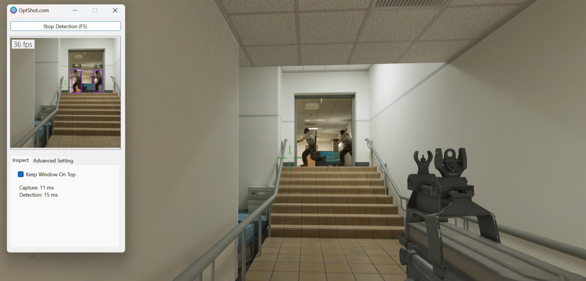
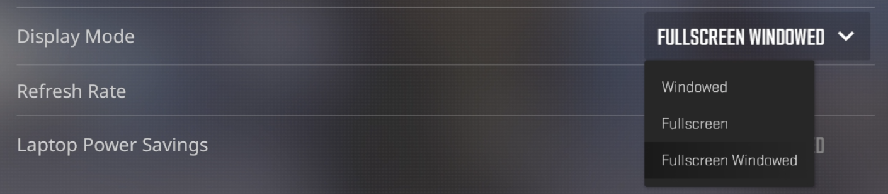
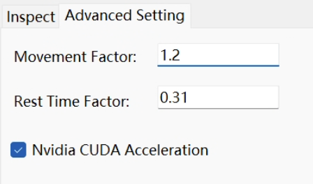

# 🎯The optimal AI Aimbot for CS2

🛠️ **Download:** [Dropbox](https://www.dropbox.com/scl/fo/j5t8m00dz67i6fsbrh6v9/h?rlkey=n0ut66dbdy4xq88372eovbu5e&dl=0)

🌐 **Homepage:** [OptShot.com](https://optshot.com)


## ✨ How is Optshot better than similar AI-Based tools?

🌞 **Simpleness:** Simplicity is the design philosophy of OptShot. No cumbersome installation, no obscure settings; most configuration parameters are automatically set to optimal values. You don't need to be an expert to use it.

⭐ **Compatibility:** Compatible with Win10/Win11 x64 platforms, supporting both CPU and GPU configurations.

🔥 **Efficiency:** Developed using native code (instead of Python), featuring screen capture based on DXGI, agent detection using YOLOv8, and well-designed target tracking, resulting in exceptional performance.

🎖️ **Safety:** Non-invasive to the game program itself, employing a biomimetic mouse movement strategy, with no risk of detection.


## ▶️  Basic Usage

Launch the game in **Fullscreen Windowed** mode:



Press the "Start" button (or use hotkey "**F5**") .


## ⚙️ Advanced Setting



### 🖱️ Mouse Calibration

🏃 **Movement Factor**

Due to differences in mouse DPI, game resolution, and in-game Mouse Sensitivity settings, it's suggested to calibrate the mouse movement range to ensure accurate targeting.

Procedure: 

1. Open a bot map and keep the bot stationary using the following console commands ([video tutorial](https://www.youtube.com/watch?v=aQGWp-XiwNM&ab_channel=FunVector)):  

```
sv_cheats 1
bot_stop 1
```


2. Slightly move the mouse pointer away from the bot. Press **F6** to execute a single "Capture-> Detection -> Mouse Movement" precedure. 

   Adjust this value until a single detection roughly aligns with the character. 

   The higher this value, the greater the distance the mouse will move. 

   Too large a value will cause the mouse to vibrate.

https://github.com/OptShot/OptShot/assets/162872822/9d1185ac-2fd3-4933-b3c8-482653994c0f


⏱️ **Rest Time Factor**

After mouse movement, the screen doesn't immediately change. Therefore, it's necessary to wait for a period before continuing detection. 

Typically, a value of 0.3 is appropriate. Increasing this factor extends the waiting time. Too small a value will cause the mouse to vibrate.


### 🚀 Nvidia CUDA Acceleration

By default, the AI detection algorithm runs on the CPU. For Nvidia graphics cards, you can utilize CUDA to accelerate detection speed, usually resulting in a 100% to 300% speed boost.

However, be aware that if your GPU is already exhausted by the game, the detection speed might be slower than CPU. In such cases, you can:

1. Limit CS's maximum frame rate via console command `fps_max 60`.
2. Lower the game's graphics quality or resolution.


## ❔Frequently Asked Questions

🍎 **How it works?**

The software captures a 640x640 area at the screen center, employs AI object detection (Yolo-V8) to locate characters within it, and then controls the mouse for aiming.


🍄 **Error: DXGI_ERROR_UNSUPPORTED**

This typically occurs in situations where both the CPU's integrated graphics and discrete graphics card are present. Please enable `direct connection mode` for the discrete graphics card.


🍇 **Does it support games other than CS2?**

In theory, yes, but OptShot is not optimized for these games.
